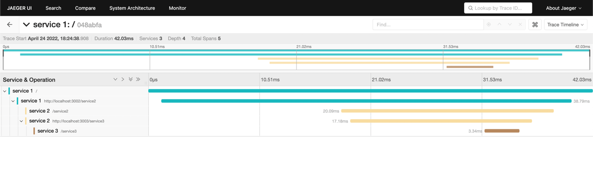

# Example Jaeger OpenTelementry

Microservice tracing example with Jaeger and OpenTelemetry.

Links:
- [Jaeger](https://www.jaegertracing.io/)
- [OpenTelemetry](https://opentelemetry.io/)

## Getting Started

To install:

```sh
$ npm i
```

To run:
```sh
$ docker-compose up -d
$ npm start
```

Jaeger GUI starts on http://localhost:16686/

Process runs on:
- Service 1: http://localhost:3001
- Service 2: http://localhost:3002
- Service 3: http://localhost:3003

And then in console run:

```sh
$ curl -X GET http://localhost:3001
```

## Tracing Result

